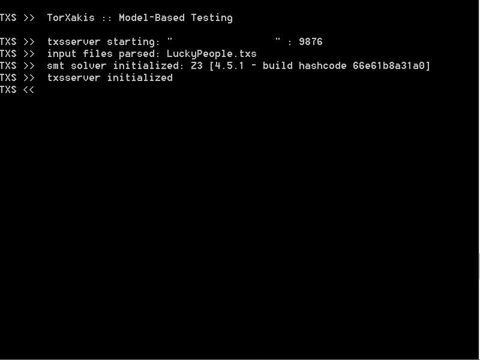

Welcome to the TorXakis wiki!
=============================

TorXakis uses a [[specification]] to test a System-Under-Test (SUT) or
simulate a System. A TorXakis specification contains three parts: \*
Model - Composition of processes instances that models the behavior of
the SUT \* Adapter - Map abstract specification on actual SUT
interfaces. \* Connection - Describe external interfaces to SUT or of
simulated system.

TorXakis uses the Input-Output Conformance (IOCO) theory to check the
actual against the specified externally observable behaviour.

TorXakis is a command line tool that takes zero or more specification
files as input.

   TorXakis in action!
